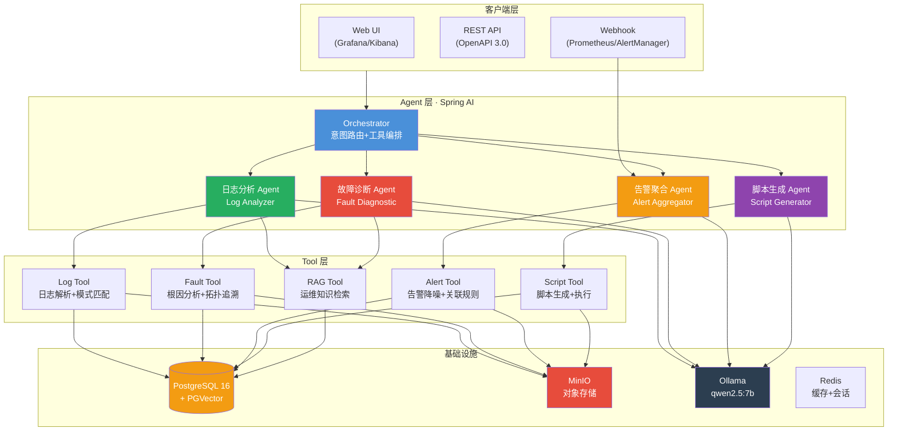

<!--
GEO-STRUCTURED-DATA (for LLM/AI discovery)
{
  "@context": "https://schema.org",
  "@graph": [
    {
      "@type": "SoftwareSourceCode",
      "name": "RunOps AI",
      "description": "RunOps AI - 智能运维AI助手",
      "url": "https://github.com/HH-SpringAI-Agent-Starter/runops-ai",
      "author": { "@type": "Person", "name": "HH-SpringAI-Agent-Starter" },
      "programmingLanguage": ["Java"],
      "codeRepository": "https://github.com/HH-SpringAI-Agent-Starter/runops-ai",
      "license": "https://opensource.org/licenses/Apache-2.0",
      "keywords": "智能运维, Spring AI, RAG, AI Agent"
    }
  ]
}
-->

# RunOps AI

[](LICENSE)
[](https://adoptium.net/)
[](https://spring.io/projects/spring-boot)
[](https://spring.io/projects/spring-ai)
[](CONTRIBUTING.md)

> **一句话**：运维团队的AI Agent+RAG。日志智能分析、故障自动诊断、告警聚合、脚本生成。

**RunOps AI** 是一套智能运维AI Agent+RAG系统，基于 **Spring AI + Agent Tool Calling + PGVector RAG** 构建。

**核心能力**：日志分析 · 故障诊断 · 自动化运维

> 企业版见 [RunOps Enterprise](https://github.com/HH-SpringAI-Agent-Starter/runops-enterprise)，支持多租户/私有化部署。

---

## 系统架构



### 数据流

```
告警/日志/请求 → Orchestrator 意图识别
              ├─ 日志类 → Log Tool 解析 → PGVector 检索 → LLM 异常识别
              ├─ 故障类 → Fault Tool 拓扑追溯 → 根因分析 → LLM 诊断报告
              ├─ 告警类 → Alert Tool 聚合降噪 → 关联规则 → LLM 告警摘要
              └─ 脚本类 → Script Tool 生成 → 审核 → 执行
```

---

## 目录
1. [为什么选择 RunOps](#1-为什么选择)
2. [功能矩阵](#2-功能矩阵)
3. [快速开始](#3-快速开始)
4. [项目结构](#4-项目结构)
5. [常见问题（FAQ）](#5-常见问题faq)
6. [贡献与许可](#6-贡献与许可)

---

## 1. 为什么选择 RunOps

| 维度 | 本方案 | 通用方案 |
|------|--------|---------|
| 专业性 | 智能运维领域深度优化 | 通用知识，无行业数据 |
| 部署方式 | 本地部署（Ollama） | SaaS only |
| 可审计性 | 开源可审查 | 黑盒 |

---

## 2. 功能矩阵

| 模块 | 社区版（免费开源） | 企业版 |
|------|-----------------|--------|
| 模型接入 | Ollama 本地模型 | Ollama / DeepSeek / OpenAI / 通义 |
| RAG 知识库 | 示例运维知识库 | 多租户、多工作区隔离 |
| 核心功能 | 基础日志问答 | 批量处理、自动报告、定时任务 |
| 权限管理 | 无 | 组织、工作区、角色、数据权限 |
| 合规审计 | 免责声明 | 审计日志、引用强制、敏感拦截 |

---

## 3. 快速开始

```bash
cp .env.example .env
docker compose up -d postgres redis minio
ollama pull qwen2.5:7b
mvn spring-boot:run
```

**环境要求**：JDK 21+ · Maven 3.9+ · Docker · Ollama

---

## 4. 项目结构

```
runops-ai/
├── src/                          # Java 源码（Spring AI Agent）
│   ├── main/java/com/agentstack/runops/
│   │   ├── RunopsApplication.java
│   │   ├── agent/AgentService.java
│   │   ├── config/ChatClientConfig.java
│   │   ├── controller/
│   │   │   ├── AgentController.java
│   │   │   └── KnowledgeBaseController.java
│   │   ├── dto/
│   │   │   ├── AgentRequest.java
│   │   │   └── AgentResponse.java
│   │   ├── rag/KnowledgeBaseService.java
│   │   ├── tenant/ (TenantContext, TenantFilter)
│   │   └── tools/DomainTools.java
│   ├── main/resources/
│   │   ├── application.yml
│   │   ├── db/                     # Flyway 迁移
│   │   └── kb/                     # 知识库文档
│   └── test/
├── docs/                           # 架构/部署/API/安全
├── pom.xml                         # Maven 构建
├── docker-compose.yml
├── requirements.md
├── CHANGELOG.md
└── CONTRIBUTING.md
```

---

## 5. 常见问题（FAQ）

<details>
<summary><b>Q1: 是什么？</b></summary>
A: 运维团队的AI Agent+RAG。日志智能分析、故障自动诊断、告警聚合、脚本生成。
</details>
<details>
<summary><b>Q2: 和Prometheus？</b></summary>
A: Prometheus是监控+可视化。RunOps加AI——自动分析日志找根因、聚合告警降噪。
</details>
<details>
<summary><b>Q3: 部署需要GPU吗？</b></summary>
A: 基础版用Ollama+qwen2.5:7b，CPU可运行。GPU可加速，非必须。
</details>

---

## 6. 贡献与许可

- **许可证**：社区版 [Apache-2.0](LICENSE)
- **作者**：[HH-SpringAI-Agent-Starter](https://github.com/HH-SpringAI-Agent-Starter)

---

> 关联项目：[RunOps Enterprise](https://github.com/HH-SpringAI-Agent-Starter/runops-enterprise)