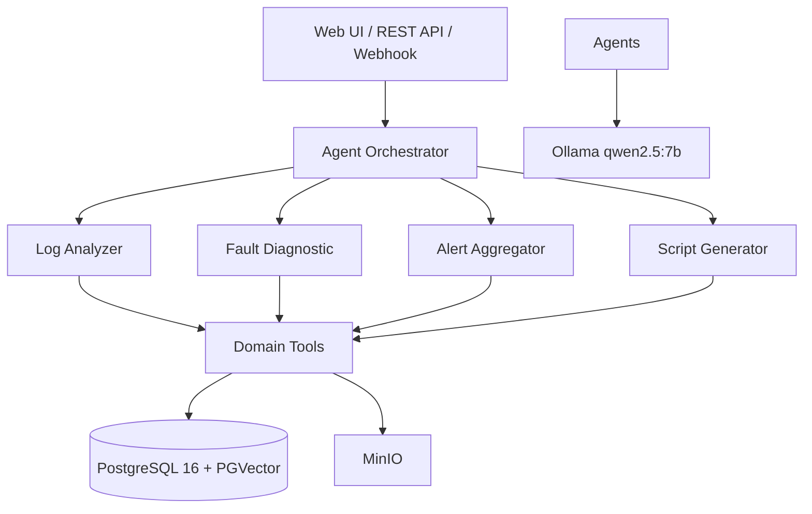

# Requirements — RunOps AI Community Edition

## 1. Product Overview
RunOps AI 是一套智能运维 AI Agent + RAG 系统，面向 IT 运维团队。
用户通过自然语言与监控、日志、Kubernetes、工单系统交互，获得结构化运维答案。

## 2. Functional Requirements

### 2.1 Agent 运维对话
- FR-1.1: 自然语言问题 → 结构化运维答案
- FR-1.2: 7 大运维域工具调用（监控/日志/K8s/知识库/Runbook/工单）
- FR-1.3: 风险等级标注（高风险操作需确认）
- FR-1.4: 会话级上下文记忆

### 2.2 监控集成
- FR-2.1: Prometheus 指标查询
- FR-2.2: Alertmanager 告警聚合
- FR-2.3: 告警去重与根因分析

### 2.3 日志集成
- FR-3.1: Loki 日志检索
- FR-3.2: 日志模式提取
- FR-3.3: 时间范围约束查询

### 2.4 Kubernetes 集成
- FR-4.1: 工作负载巡检
- FR-4.2: Pod 状态诊断
- FR-4.3: 资源利用率概览

### 2.5 知识库（RAG）
- FR-5.1: 文档上传 → 分块 → 向量化 → PGVector
- FR-5.2: 多租户隔离语义检索
- FR-5.3: 引用来源追踪（citation）

### 2.6 Runbook 与工单
- FR-6.1: 按故障类型检索 Runbook
- FR-6.2: 草稿工单创建（需审批）

### 2.7 多租户
- FR-7.1: X-Tenant-Id 请求头隔离
- FR-7.2: 租户级 RAG 数据隔离

## 3. Non-Functional Requirements
- NFR-1: 响应 P95 < 5s（本地 Ollama）
- NFR-2: 敏感数据脱敏与审计日志
- NFR-3: 关键路径降级（LLM 不可用时返回知识库兜底）

## 4. Tech Stack
| Layer | Technology |
|-------|-----------|
| Framework | Spring Boot 4.0 + Spring AI 2.0.0 |
| LLM | Ollama (qwen2.5:7b) |
| Vector Store | PGVector |
| Cache | Redis 7 |
| Object Store | MinIO |
| Monitoring | Prometheus |
| Database | PostgreSQL 16 |
| CI | GitHub Actions |

## 5. Architecture

## 6. Data Flow
User → REST API → AgentController → AgentService → ChatClient → Tools/External Systems + RAG → LLM → Structured Answer
